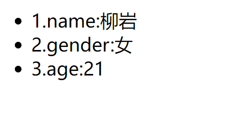

# Vue入门

# 学习目标

- 会创建Vue实例，知道Vue的常见属性 
- 会使用Vue的生命周期的钩子函数 
- 会使用vue常见指令 
- 会使用vue计算属性和watch监控 
- 会编写Vue组件 
- 掌握组件间通信

# 前端开发模式的发展

- 静态页面

最初的网页以HTML为主，是纯静态的网页。网页是只读的，信息流只能从服务的到客户端单向流通。开发人员也只关心页面的样式和内容即可。 

- 异步刷新，操作DOM 

  - 1995年，网景工程师Brendan Eich 花了10天时间设计了JavaScript语言. 

    随着JavaScript的诞生，我们可以操作页面的DOM元素及样式，页面有了一些动态的效果，但是依然是以静态为主。 

  - ajax盛行：

    2005年开始，ajax逐渐被前端开发人员所重视，因为不用刷新页面就可以更新页面的数据和渲染效果。 

    此时的开发人员不仅仅要编写HTML样式，还要懂ajax与后端交互，然后通过JS操作Dom元素来实现页面动态效果。比较流行的框架如Jquery就是典型代表。

-  MVVM，关注模型和视图 
  - 2008年，google的Chrome发布，随后就以极快的速度占领市场，超过IE成为浏览器市场的主导者。 
  - 2009年，Ryan Dahl在谷歌的Chrome V8引擎基础上，打造了基于事件循环的异步IO框架：Node.js。 
    - 基于时间循环的异步IO 
    - 单线程运行，避免多线程的变量同步问题 
    - JS可以编写后台diamante，前后台统一编程语言 
  - node.js的伟大之处不在于让JS迈向了后端开发，而是构建了一个庞大的生态系统。 
  - 2010年，NPM作为node.js的包管理系统首次发布，开发人员可以遵循Common.js规范来编写Node.js模块， 然后发布到NPM上供其他开发人员使用。目前已经是世界最大的包模块管理系统。 
  - 随后，在node的基础上，涌现出了一大批的前端框架：


## MVVM模式 

- M：即Model，模型，包括数据和一些基本操作 
- V：即View，视图，页面渲染结果 
- VM：即View-Model，模型与视图间的双向操作（无需开发人员干涉）

在MVVM之前，开发人员从后端获取需要的数据模型，然后要通过DOM操作Model渲染到View中。而后当用户操作视图，我们还需要通过DOM获取View中的数据，然后同步到Model中。 

而MVVM中的VM要做的事情就是把DOM操作完全封装起来，开发人员不用再关心Model和View之间是如何互相影响的：

- 只要我们Model发生了改变，View上自然就会表现出来。 

- 当用户修改了View，Model中的数据也会跟着改变。

把开发人员从繁琐的DOM操作中解放出来，把关注点放在如何操作Model上:


# 初识Vue

vue是一款MVVM模式的框架。

是一套用于构建用户界面的渐进式框架。与其它大型框架不同的是，Vue 被设计为可以自底向上逐层应用。Vue 的核心库只关注视图层，不仅易于上手，还便于与第三方库或既有项目整合。另一方面，当与现代化的工具链以及各种支持类库结合使用时，Vue 也完全能够为复杂的单页应用提供驱动。

前端框架三巨头：Vue.js、React.js、AngularJS，vue.js以期轻量易用著称，vue.js和React.js发展速度最快， AngularJS还是老大。 

官网：https://cn.vuejs.org/ 

参考：https://cn.vuejs.org/v2/guide/

Git地址：https://github.com/vuejs

# Node、NPM

NPM是Node提供的模块管理工具，可以非常方便的下载安装很多前端框架，包括Jquery、AngularJS、 VueJs都有。为了后面学习方便，我们先安装node及NPM工具。

## 下载Node.js

搭建Vue的环境工具：node.js（JavaScript的运行环境），然后再用nodejs里面的npm（包管理和分发工具）来安装依赖包。

下载地址：https://nodejs.org/en/download/

完成以后，在控制台输入

```shell
node -v
```

看到版本信息：

## NPM

安装完成Node应该自带了NPM了，在控制台输入 npm -v 查看版本信息

# 快速入门

## 创建工程


然后新建一个module：


选中static web，静态web项目：


位置信息：


## 安装Vue

> 安装Vue本章看这里（其他不用看）：
>
> https://blog.csdn.net/pxiangcai/article/details/117708695
>
> https://blog.csdn.net/a_gust_wind/article/details/120080519
>
> [npm安装vue.js - 简书 (jianshu.com)](https://www.jianshu.com/p/d9ec722db099)
>
> [IDEA创建vue项目详解](https://blog.csdn.net/m0_48402871/article/details/115048495)

### 下载安装

下载地址：https://github.com/vuejs/vue 

可以下载2.5.16版本https://github.com/vuejs/vue/archive/v2.5.16.zip 

下载解压，得到vue.js文件。

### 使用CDN安装

或者也可以直接使用公共的CDN服务：

```xml
<!-- 开发环境版本，包含了用帮助的命令行警告 -->
<script src="https://cdn.jsdelivr.net/npm/vue/dist/vue.js"></script>
```

或者：

```xml
<!-- 生产环境版本，优化了尺寸和速度 -->
<script src="https://cdn.jsdelivr.net/npm/vue"></script>
```

### 使用npm安装（推荐）

在idea的左下角，有个Terminal按钮，点击打开控制台：


进入hello-vue目录：


先输入： `npm init -y` 进行初始化


安装Vue，输入命令： `npm install vue --save`


然后就会在hello-vue目录发现一个node_modules目录，并且在下面有一个vue目录:


node_modules是通过npm安装的所有模块的默认位置

## 入门案例

### HTML模板

### vue声明式渲染

data：数据，数据是一个对象，里面有很多属性，都可以渲染到视图中 

name：这里我们指定了一个name属性页面中的 h2 元素中，我们通过{{name}}的方式，来渲染刚刚定义的name属性。

### 双向绑定

```vue
<template>
  <div>
    <div id="home">
        <input type="text" v-model="num"/>
        <h2>
            {{name}}，非常帅！！！有{{num}}位女神为他着迷。
        </h2>
        <button v-on:click="num++">Click</button>
    </div>
  </div>
</template>

<script>
    export default {
        name: 'home',     // 组件可以有自己的名字。
        data () {         // 组件的data必须是函数
            return {
                name: 'alisa',
                num:'5'
            }
        }
    }
</script>
<style lang="postcss" scoped>
    h3 {
        background-color: #82c;
    }
</style>
```

我们在data添加了新的属性： num 

在页面中有一个 input 元素，通过 v-model 与 num 进行绑定。

 同时通过 {{num}} 在页面输出


我们可以观察到，输入框的变化引起了data中的num的变化，同时页面输出也跟着变化。 

- input与num绑定，input的value值变化，影响到了data中的num值 

- 页面 {{num}} 与数据num绑定，因此num值变化，引起了页面效果变化。 

没有任何dom操作，这就是双向绑定的魅力。

### 事件处理

我们在页面添加一个按钮：

```vue
<button v-on:click="num++">Click</button>
```

- 这里用 v-on 指令绑定点击事件，而不是普通的 onclick ，然后直接操作num 

- 普通click是无法直接操作num的。

# Vue实例

## 创建Vue实例

每个 Vue 应用都是通过用 Vue 函数创建一个新的 Vue 实例开始的

## 模板或元素

每个Vue实例都需要关联一段Html模板，Vue会基于此模板进行视图渲染。

## 数据

当Vue实例被创建时，它会尝试获取在data中定义的所有属性，用于视图的渲染，并且监视data中的属性变化，当 data发生改变，所有相关的视图都将重新渲染，这就是“响应式“系统。

## 方法

```vue
<template>
  <div>
    <div id="home">
        <input type="text" v-model="num"/>
        <h2>
            {{name}}，非常帅！！！有{{num}}位女神为他着迷。
        </h2>
        <button v-on:click="add">Click</button>
    </div>
  </div>
</template>
<script>
    export default {
        name: 'home',     // 组件可以有自己的名字。
        data () {         // 组件的data必须是函数
            return {
                name: 'alisa',
                num:'0'
            }
        },
        methods:{
            add:function (){
                this.num++;
            }
        }
    }
</script>
```

## 生命周期钩子

每个 Vue 实例在被创建时都要经过一系列的初始化过程 ：创建实例，装载模板，渲染模板等等。Vue为生命周期中的每个状态都设置了钩子函数（监听函数）。每当Vue实例处于不同的生命周期时，对应的函数就会被触发调用。 

生命周期：


### 钩子函数

beforeCreated：我们在用Vue时都要进行实例化，因此，该函数就是在Vue实例化是调用，也可以将他理解为初始化函数比较方便一点，在Vue1.0时，这个函数的名字就是init。 

created：在创建实例之后进行调用。 

beforeMount：页面加载完成，没有渲染。如：此时页面还是{{name}} 

mounted：我们可以将他理解为原生js中的window.onload=function({.,.}),或许大家也在用jquery，所以也可以理解为jquery中的$(document).ready(function(){….})，他的功能就是：在dom文档渲染完毕之后将要执行的函数， 该函数在Vue1.0版本中名字为compiled。 此时页面中的{{name}}已被渲染成alisa

beforeDestroy：该函数将在销毁实例前进行调用 。 

destroyed：改函数将在销毁实例时进行调用。 beforeUpdate：组件更新之前。 

updated：组件更新之后。 例如：created代表在vue实例创建后； 我们可以在Vue中定义一个created函数，代表这个时期的钩子函数：

```vue
<script>
    export default {
        name: 'home',     // 组件可以有自己的名字。
        data () {         // 组件的data必须是函数
            return {
                name: 'alisa',
                num:'0'
            }
        },
        methods:{
            add:function (){
                this.num++;
            }
        },
        created() {
            this.num=5
        }
    }
</script>
```

### this

```vue
 methods:{
            add:function (){
                this.num++;
                console.log(this);
            }
        }
```


# 指令

什么是指令？ 指令 (Directives) 是带有 v- 前缀的特殊特性。指令特性的预期值是：单个 JavaScript 表达式。指令的职责是， 当表达式的值改变时，将其产生的连带影响，响应式地作用于 DOM。 

例如我们在入门案例中的v-on，代表绑定事件。

## 插值表达式

### 花括号

```vue
{{表达式}}
```

说明： 

- 该表达式支持JS语法，可以调用js内置函数（必须有返回值） 
- 表达式必须有返回结果。例如 1 + 1，没有结果的表达式不允许使用，如：var a = 1 + 1; 
- 可以直接获取Vue实例中定义的数据或函数 

示例：


### 插值闪烁

使用{{}}方式在网速较慢时会出现问题。在数据未加载完成时，页面会显示出原始的 {{}} ，加载完毕后才显示正 确数据，我们称为插值闪烁。 

我们将网速调慢一些，然后试试看刚才的案例：


### v-text、v-html

使用v-text和v-html指令来替代 {{}} 

说明： 

- v-text：将数据输出到元素内部，如果输出的数据有HTML代码，会作为普通文本输出 

- v-html：将数据输出到元素内部，如果输出的数据有HTML代码，会被渲染

HTML:

```html
<div id="app">
	v-text:<span v-text="hello"></span> <br/>
	v-html:<span v-html="hello"></span>
</div>	
```

JS:

```javascript
var vm = new Vue({
	el:"#app",
	data:{
		hello: "<h1>大家好，我是峰哥</h1>"
	}
})
```


## v-model

刚才的v-text和v-html可以看做是单向绑定，数据影响了视图渲染，但是反过来就不行。接下来学习的v-model是 双向绑定，视图（View）和模型（Model）之间会互相影响。

既然是双向绑定，一定是在视图中可以修改数据，这样就限定了视图的元素类型。目前v-model的可使用元素有：

- input 
- select 
- textarea 
- checkbox 
- radio 
- components（Vue中的自定义组件）

基本上除了最后一项，其它都是表单的输入项：

```vue
<template>
    <div id="app">
        <input type="checkbox" v-model="language" value="Java"/>Java<br/>
        <input type="checkbox" v-model="language" value="PHP"/>PHP<br/>
        <input type="checkbox" v-model="language" value="C++"/>C++<br/>
        <h1>你选择了：{{language.join(',')}}</h1>
    </div>
</template>

<script>
    export default {
        name: 'app',     // 组件可以有自己的名字。
        data () {         // 组件的data必须是函数
            return {
                language: []
            }
        }
    }
</script>
<style lang="postcss" scoped>
    h3 {
        background-color: #82c;
    }
</style>
```

- 多个 CheckBox 对应一个model时，model的类型是一个数组，单个checkbox值默认是boolean类型 
- radio对应的值是input的value值


## v-on

### 基本用法

v-on指令用于给页面元素绑定事件

语法：

```vue
v-on:事件名="js片段或函数名"
```

```vue
<template>
    <div id="app">
        <!--事件中直接写js片段-->
        <button v-on:click="num++">增加一个</button><br/>
        <!--事件指定一个回调函数，必须是Vue实例中定义的函数-->
        <button v-on:click="decrement">减少一个</button><br/>
        <h1>余额：{{num}}</h1>
    </div>
</template>

<script>
    export default {
        name: 'app',     // 组件可以有自己的名字。
        data () {         // 组件的data必须是函数
            return {
                num: 1000
            }
        },
        methods:{
            decrement(){
                this.num--;
            }
        }
    }
</script>
```


另外，事件绑定可以简写，例如 v-on:click='add' 可以简写为 `@click='add'`

### 事件修饰符

[你真的了解stopPropagation吗？ - 知乎 (zhihu.com)](https://zhuanlan.zhihu.com/p/420923542)

在事件处理程序中调用 event.preventDefault() 或 event.stopPropagation() 是非常常见的需求。尽管我 们可以在方法中轻松实现这点，但更好的方式是：方法只有纯粹的数据逻辑，而不是去处理 DOM 事件细节。 

为了解决这个问题，Vue.js 为 v-on 提供了事件修饰符。修饰符是由点开头的指令后缀来表示的：

- .stop ：阻止事件冒泡到父元素 

- .prevent ：阻止默认事件发生 

- .capture ：使用事件捕获模式 

- .self ：只有元素自身触发事件才执行。（冒泡或捕获的都不执行）

- .once ：只执行一次 

阻止默认事件

```vue
<template>
    <div id="app">
        <!--右击事件，并阻止默认事件发生，即阻止弹窗-->
        <button v-on:contextmenu.prevent="num++">增加一个</button><br/>
        <!--右击事件，不阻止默认事件发生，即出现弹窗-->
        <button v-on:contextmenu="decrement($event)">减少一个</button><br/>
        <h1>余额：{{num}}</h1>
    </div>
</template>

<script>
    export default {
        name: 'app',     // 组件可以有自己的名字。
        data () {         // 组件的data必须是函数
            return {
                num: 1000
            }
        },
        methods:{
            decrement(ev){
                // ev.preventDefault();
                this.num--;
            }
        }
    }
</script>
```

（右键“增加一个”，不会触发默认的浏览器右击事件；右键“减少一个”，会触发默认的浏览器右击事件）


### 案件修饰符

在监听键盘事件时，我们经常需要检查常见的键值。Vue 允许为 v-on 在监听键盘事件时添加按键修饰符：

```vue
<!-- 只有在 `keyCode` 是 13 时调用 `vm.submit()` -->
<input v-on:keyup.13="submit">
```

记住所有的 keyCode 比较困难，所以 Vue 为最常用的按键提供了别名：

```vue
<!-- 同上 -->
<input v-on:keyup.enter="submit">

<!-- 缩写语法 -->
<input @keyup.enter="submit">
```

全部的按键别名： 

- .enter 
- .tab 
- .delete (捕获“删除”和“退格”键) 
- .esc 
- .space 
- .up 
- .down 
- .left 
- .right

### 组合按钮

可以用如下修饰符来实现仅在按下相应按键时才触发鼠标或键盘事件的监听器：

- .ctrl 
- .alt 
- .shift

如:

```vue
<!-- Alt + C -->
<input @keyup.alt.67="clear">
<!-- Ctrl + Click -->
<div @click.ctrl="doSomething">Do something</div>
```

## v-for

遍历数据渲染页面是非常常用的需求，Vue中通过v-for指令来实现

### 遍历数组

```vue
v-for="item in items"
```

- items：要遍历的数组，需要在vue的data中定义好。 

- item：迭代得到的数组元素的别名

```vue
<template>
    <div id="app">
        <ul>
            <li v-for="user in users">
                {{user.name}},{{user.gender}},{{user.age}}
            </li>
        </ul>
    </div>
</template>
<script>
    export default {
        name: 'app',     // 组件可以有自己的名字。
        data() {         // 组件的data必须是函数
            return {
                users: [
                    {name: '柳岩', gender: '女', age: 21},
                    {name: '峰哥', gender: '男', age: 18},
                    {name: '范冰冰', gender: '女', age: 24},
                    {name: '刘亦菲', gender: '女', age: 18},
                    {name: '古力娜扎', gender: '女', age: 25}]
            }
        }
    }
</script>
```


### 数组角标

在遍历的过程中，如果我们需要知道数组角标，可以指定第二个参数：

```
v-for="(item,index) in items"
```

- items：要迭代的数组 

- item：迭代得到的数组元素别名 

- index：迭代到的当前元素索引，从0开始。

```vue
<template>
    <div id="app">
        <ul>
            <li v-for="(user,index) in users">
                {{index+1}},{{user.name}},{{user.gender}},{{user.age}}
            </li>
        </ul>
    </div>
</template>

<script>
    export default {
        name: 'app',     // 组件可以有自己的名字。
        data() {         // 组件的data必须是函数
            return {
                users: [
                    {name: '柳岩', gender: '女', age: 21},
                    {name: '峰哥', gender: '男', age: 18},
                    {name: '范冰冰', gender: '女', age: 24},
                    {name: '刘亦菲', gender: '女', age: 18},
                    {name: '古力娜扎', gender: '女', age: 25}]
            }
        }
    }
</script>
```


### 遍历对象

v-for除了可以迭代数组，也可以迭代对象。语法基本类似:

```vue
v-for="value in object"
v-for="(value,key) in object"
v-for="(value,key,index) in object"
```

- 1个参数时，得到的是对象的属性 

- 2个参数时，第一个是属性，第二个是键 

- 3个参数时，第三个是索引，从0开始

```vue
<template>
    <div id="app">
        <ul>
            <li v-for="(value,key,index) in users">
                {{index+1}}.{{key}}:{{value}}
            </li>
        </ul>
    </div>
</template>

<script>
    export default {
        name: 'app',     // 组件可以有自己的名字。
        data() {         // 组件的data必须是函数
            return {
                users: {name: '柳岩', gender: '女', age: 21}
            }
        }
    }
</script>
```



### key

当 Vue.js 用 v-for 正在更新已渲染过的元素列表时，它默认用“就地复用”策略。如果数据项的顺序被改变，Vue 将不会移动 DOM 元素来匹配数据项的顺序， 而是简单复用此处每个元素，并且确保它在特定索引下显示已被渲染 过的每个元素。

这个功能可以有效的提高渲染的效率。 

但是要实现这个功能，你需要给Vue一些提示，以便它能跟踪每个节点的身份，从而重用和重新排序现有元素，你 需要为每项提供一个唯一 key 属性。理想的 key 值是每项都有的且唯一的 id。

```vue
<ul>
	<li v-for="(item,index) in items" :key=index></li>
</ul>
```

- 这里使用了一个特殊语法： :key="" 我们后面会讲到，它可以让你读取vue中的属性，并赋值给key属性 

- 这里我们绑定的key是数组的索引，应该是唯一的

## v-if、v-show

### 基本使用

v-if，顾名思义，条件判断。当得到结果为true时，所在的元素才会被渲染。

```vue
v-if="布尔表达式"
```

```vue
<template>
    <div id="app">
        <ul>
            <button v-on:click="show = !show">点我</button>
            <br>
            <h1 v-if="show">
                v-if
            </h1>
            <h1 v-show="show">
                v-show
            </h1>
        </ul>
    </div>
</template>

<script>
    export default {
        name: 'app',     // 组件可以有自己的名字。
        data() {         // 组件的data必须是函数
            return {
                show: true
            }
        }
    }
</script>
```


### 与v-for结合

当v-if和v-for出现在一起时，v-for优先级更高。也就是说，会先遍历，再判断条件。

```vue
<ul>
	<li v-for="(user, index) in users" v-if="user.gender == '女'">
		{{index + 1}}. {{user.name}} - {{user.gender}} - {{user.age}}
	</li>
</ul>

```

只显示女性用户信息

### v-else

你可以使用 v-else 指令来表示 v-if 的“else 块”：

```vue
<div id="app">
	<h1 v-if="Math.random() > 0.5">
		看到我啦？！if
	</h1>
	<h1 v-else>
		看到我啦？！else
<	/h1>
</div>
```

v-else 元素必须紧跟在带 v-if 或者 v-else-if 的元素的后面，否则它将不会被识别。

v-else-if ，顾名思义，充当 v-if 的“else-if 块”，可以连续使用：

```vue
<template>
    <div id="app">
        <button v-on:click="random=Math.random()">点我呀</button><span>{{random}}</span>
            <h1 v-if="random >= 0.75">
                >=0.75
            </h1>
            <h1 v-else-if="random > 0.5">
                >0.5
            </h1>
            <h1 v-else-if="random > 0.25">
                >0.25
            </h1>
            <h1 v-else>
                其他
            </h1>
    </div>
</template>
<script>
    export default {
        name: 'app',     // 组件可以有自己的名字。
        data() {         // 组件的data必须是函数
            return {
                random: 1
            }
        }
    }
</script>
```


### v-show

另一个用于根据条件展示元素的选项是 v-show 指令。用法大致一样：

```vue
<h1 v-show="ok">Hello!</h1>
```

不同的是带有 v-show 的元素始终会被渲染并保留在 DOM 中。 v-show 只是简单地切换元素的 CSS 属性 display

## v-bind

html属性不能使用双大括号形式绑定，只能使用v-bind指令。 

在将 v-bind 用于 class 和 style 时，Vue.js 做了专门的增强。表达式结果的类型除了字符串之外，还可以 是对象或数组。

```
<div id="app">
	<!--可以是数据模型，可以是具有返回值的js代码块或者函数-->
	<div v-bind:title="title" style="border: 1px solid red; width: 50px; height:50px;"></div>
</div>
<script src="./node_modules/vue/dist/vue.js"></script>
<script type="text/javascript">
	var app = new Vue({
		el: "#app",
		data: {
			title: "title",
		}
	})
</script>
```


### 绑定class样式

- 数组语法

我们可以借助于 v-bind 指令来实现：

HTML：

```vue
<div id="app">
	<div v-bind:class="activeClass"></div>
	<div v-bind:class="errorClass"></div>
	<div v-bind:class="[activeClass, errorClass]"></div>
	</div>
<script src="./node_modules/vue/dist/vue.js"></script>
<script type="text/javascript">
	var app = new Vue({
		el: "#app",
		data: {
		activeClass: 'active',
		errorClass: ['text-danger', 'text-error']
		}
	})
</script>

```

渲染后的效果：（具有active和hasError的样式）：


- 对象语法

我们可以传给 v-bind:class 一个对象，以动态地切换 class：

```vue
<div v-bind:class="{ active: isActive }"></div>
```

上面的语法表示 active 这个 class 存在与否将取决于数据属性 isActive 的 truthiness（所有的值都是真实 的，除了false,0,“”,null,undefined和NaN）。 

你可以在对象中传入更多属性来动态切换多个 class。此外， v-bind:class 指令也可以与普通的 class 属性共 存。如下模板:

```vue
<div class="static"
	v-bind:class="{ active: isActive, 'text-danger': hasError }">
</div>
```

和如下 data：

```vue
data: {
	isActive: true,
	hasError: false
}

```

结果渲染为：

```vue
<div class="static active"></div>
```

active样式和text-danger样式的存在与否，取决于isActive和hasError的值。本例中isActive为true，hasError为 false，所以active样式存在，text-danger不存在。 

通常情况下，绑定的数据对象不必内联定义在模板里：

```vue
<div class="static" v-bind:class="classObject"></div>
```

数据：

```
data: {
	classObject: {
		active: true,
		'text-danger': false
	}
}
```


### 绑定style样式

- 数组语法


- 对象语法


### 简写

v-bind:class 可以简写为 :class

## 计算属性

在插值表达式中使用js表达式是非常方便的，而且也经常被用到。 

但是如果表达式的内容很长，就会显得不够优雅，而且后期维护起来也不方便，例如下面的场景，我们有一个日期 的数据，但是是毫秒值：

```
data:{
	birthday:1529032123201 // 毫秒值
}
```


## watch


# 组件化

在大型应用开发的时候，页面可以划分成很多部分。往往不同的页面，也会有相同的部分。例如可能会有相同的头 部导航。 

但是如果每个页面都独自开发，这无疑增加了我们开发的成本。所以我们会把页面的不同部分拆分成独立的组件， 然后在不同页面就可以共享这些组件，避免重复开发。

## 全局组件


## 组件的复用

定义好的组件，可以任意复用多次：


## 局部注册


## 组件通信


### props(父向子传递)


### props验证


### 动态静态传递


### 子向父的通信


# 路由vue-router

现在我们来实现这样一个功能： 

一个页面，包含登录和注册，点击不同按钮，实现登录和注册页切换：

## 场景模拟

### 编写父组件

### 编写登录及注册组件

### 在父组件中引用

### 问题

## vue-router简介和安装

## 快速入门

# webpack

## 安装

## 核心概念

## 编写webpack配置

### 入口entry

### 出口output

## 执行打包

## 测试运行

## 打包CSS

### 安装加载器

### index.js引入css

### 配置加载器

### 重新打包

## script脚本

## 打包HTML

## 热更新的web服务

# vue-cli

## 介绍与安装

## 快速上手

## 项目结构

## 单文件组件

## 运行


